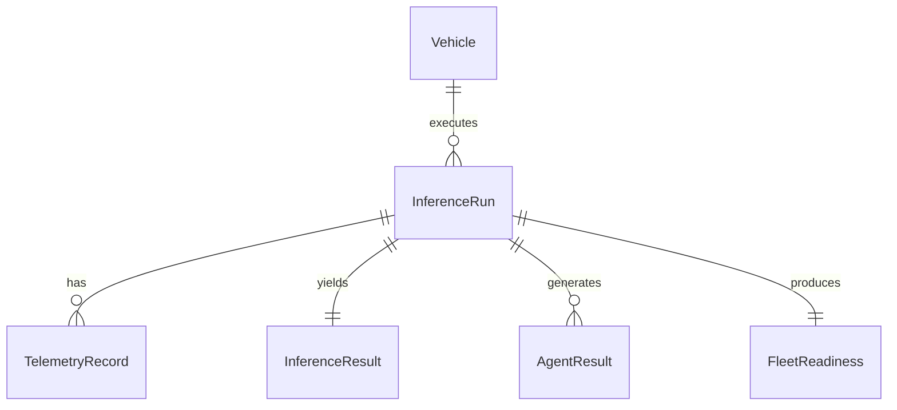

# VEDA Phase 10 Database Schema

## Entity Relationship

## Tables
1. **vehicles**: Primary vehicle identification.
   - `id`, `vehicle_id`, `vehicle_class`, `display_name`, `created_at`, `updated_at`
2. **inference_runs**: Core tracking unit.
   - `id`, `vehicle_id`, `vehicle_class`, `timestep_count`, `status`, `error_message`, `created_at`, `completed_at`
3. **telemetry_records**: Ordered inputs.
   - `id`, `inference_id`, `vehicle_id`, `timestep`, `timestamp`, `telemetry_json`
4. **inference_results**: Core ML outcomes.
   - `id`, `inference_id`, `rf_result`, `lstm_result`, `xgb_result`, `fusion_rul_hours`, `fusion_method`
5. **agent_results**: Outputs from the 6 agents.
   - `id`, `inference_id`, `agent_name`, `agent_status`, `agent_output`
6. **fleet_readiness**: Aggregated readiness.
   - `id`, `inference_id`, `readiness_status`, `ready_count`, `attention_count`, `not_ready_count`, `unknown_count`

## Indexes
Targeted indexing applied to `vehicle_id`, `inference_id`, and `created_at` for high-performance querying on the history dashboard.
